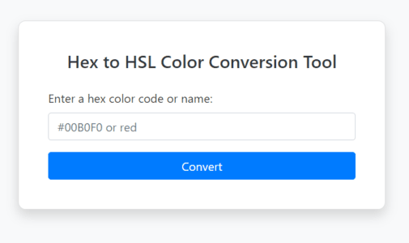

# Color Converter Tools by Sandip Dulal

Welcome to the Color Converter Tools repository! This project provides a simple web tool to convert color codes and names between different formats, such as Hex, RGB, and HSL. You can enter a color name or hex code, and the tool will display the corresponding color values.



## Features

- **Hex to RGB and HSL Conversion:( v1.0.0):** Convert Hex color codes to RGB and HSL formats effortlessly.
- **Color Name to Hex, RGB, and HSL Conversion:( v1.0.0):** Convert color names to their corresponding Hex, RGB, and HSL values.
- **Live Color Visualization:( v1.0.0):** See the color visually displayed in a box after entering a color name or Hex code.
- **User-Friendly Interface:( v1.0.0):** Enjoy a clean and intuitive design with Bootstrap for easy usage.
- **Search Recommendation:( v1.1.1):** Get suggestions for color names as you type, with the ability to select from a list of matching colors.
- **Switch Tab Option:( v1.1.1):** Easily switch between manual input and color picker tabs to input colors or hex codes.
- **Dynamic Color Picker:( v1.1.1):** Select colors dynamically with real-time evaluation of Hex, RGB, and HSL formats.
- **Recommended Colors:( v1.1.1):** Discover recommended colors based on a mathematical algorithm after selecting a color.


## Demo

Check out the live demo at [colorconverter.sandipdulal.com.np](http://colorconverter.sandipdulal.com.np).

## Installation

To run this project locally, follow these steps:

1. **Clone the repository:**

   ```bash
   git clone https://github.com/yourusername/hex-code-rgb-hsl-color-conversion.git
   ```

2. **Navigate to the project directory:**

   ```bash
   cd hex-code-rgb-hsl-color-conversion
   ```

3. **Open the index.html file in your browser:**

   ```bash
   open index.html
   ```

## Usage

1. Enter a Hex color code or a color name in the input field.
2. Click the "Convert" button.
3. The tool will display the color in a visual box and provide the Hex, RGB, and HSL values.

## Color Names and Hex Code Search

- The `colors.js` file contains a list of color names that helps in searching for color names using fuzzy search.
- Searching by Hex code is independent of `colors.js` and uses a direct algorithmic approach i.e it first convert to hexadecimaal to RGB and RGB to HCL and it also uses fuzzy search.

## Contributing

If you'd like to contribute to this project, please fork the repository and use a feature branch. Pull requests are warmly welcome.

## License

This project is open-source and available under the [MIT License](LICENSE).
